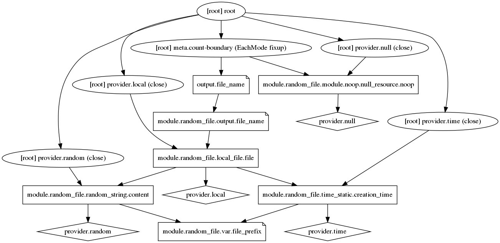
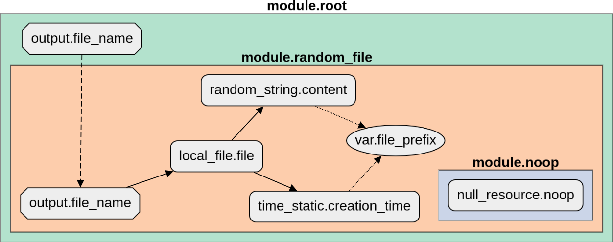
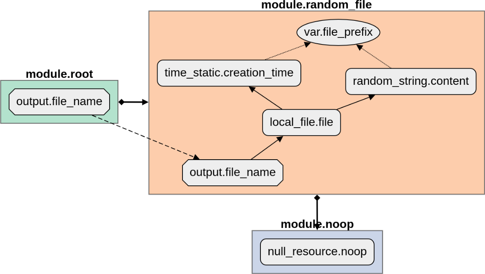
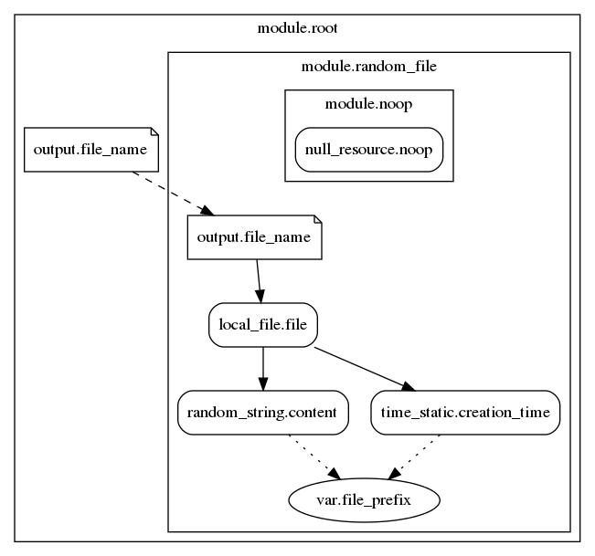
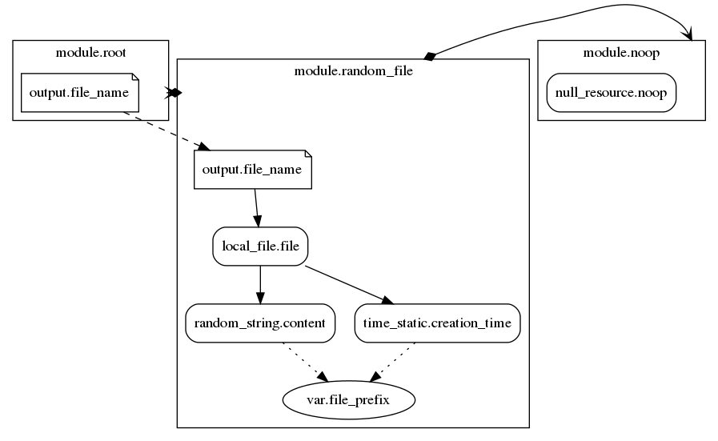

# Terraform graph beautifier

Command line tool allowing to convert the barely usable output of the `terraform graph` command to something more
meaningful and explanatory.

| `terraform graph` raw output | Processed output |
| :-: | :-: |
|  |  |

## Installation

```bash
go install github.com/pcasteran/terraform-graph-beautifier
```

Basic usage:

```bash
cd samples/config1/
terraform init

terraform graph | terraform-graph-beautifier \
    --output-type=cyto-html \
    > config1.html
```

## Input and outputs

The command performs the following:

1. Parsing of the Graphviz [Dot](https://www.graphviz.org/doc/info/lang.html) script generated by `terraform graph` from
   the standard input or the specified file (`--input` parameter).
1. Extraction of the graph containing the Terraform configuration elements and their dependencies.
1. Generation of the result to the standard output or file (`--output` parameter). The following output
   types (`--output-type` parameter) are supported:
    - **cyto-html** (default): an HTML page using [Cytoscape.js](https://js.cytoscape.org/) to render the graph (
      see [example](doc/config1.html));
    - **cyto-json**: a JSON document of the graph in the
      Cytoscape.js [format](https://js.cytoscape.org/#notation/elements-json) (see [example](doc/config1.json));
    - **graphviz**: a cleaned and prettier Dot script that can be piped to a
      Graphviz [rendering command](https://linux.die.net/man/1/dot) (see [example](doc/config1.gv)).

### Input graph loading and processing

The loading of the input graph involves the following steps:

1. **Cleaning the Dot script**
    1. Renaming the nodes using a more consistent
       pattern: `[root] rsc_type.rsc_name` => `module.root.rsc_type.rsc_name`.
    1. Using the `'` character instead of `"` fot the maps keys: `buckets["artefacts"]` => `buckets['artefacts']`.
    1. Removing the nodes and edges generated by Terraform but not corresponding to configuration elements (aka TF
       junk). This can be deactivated via the `--keep-tf-junk` parameter.
1. **Filtering**
    - Using user-provided pattern(s) to exclude some elements (resource, var, module, provider, ...) from the output.
    - These patterns are [Go regexp](https://golang.org/pkg/regexp/) and are matched line by line against the output of
      the **cleaning** step, so use the `"root.rsc_type.rsc_name"` naming convention.
    - These patterns are provided using the `--exclude` parameter, you can repeat it multiple times.

### Output configuration

#### Modules embedding

An important option is to choose whether to embed a submodule in its parent module or not. The `--embed-modules`
parameter allows to control this behavior:

- if **true** (default), the modules subgraphs will be embedded inside their parent;
- if **false**, all the subgraphs are drawn at the same level and an edge is drawn from a parent to its children.

As a rule of thumb, `--embed-modules=true` works well for small to medium size graphs but for larger ones it can produce
a very dense and compact result with a lot of overlapping nodes and intersecting edges.

| Output type | `--embed-modules=true` | `--embed-modules=false` |
| :-: | :-: | :-: |
| **cyto-html** |  |  |
| **graphviz** |  |  |

#### HTML output templating

The command uses Go [templates](https://golang.org/pkg/text/template/) to create the HTML output.
The following annotations will be replaced during the output generation:

- **{{.PageTitle}}**: will be replaced by the graph name (see `--graph-name` parameter).
- **{{.GraphElementsJSON}}**: will be replaced by the graph elements JSON object.

A basic template, with sensible default values for the graph rendering (style and layout), is provided and is embedded
in the binary.

If you want to customize the output, you can provide your own template and specify to use it with
the `--cyto-html-template` parameter.
It is good practice to check in your custom templates alongside your Terraform configuration.

## Static assets management

The static assets (HTML templates, ...) are embedded in the binary using [pkger](https://github.com/markbates/pkger).
The generated `pkged.go` file is checked-in in order for the repository to be "go-gettable".

In development mode, when working on the templates for example, you don't want to launch the `pkged.go` generation
process every time you modify an asset file; instead you would prefer using the current version of the file.
To do this, simply configure your IDE to use the build tag `skippkger`.
